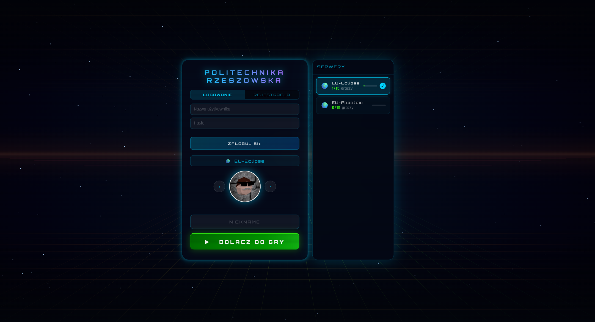
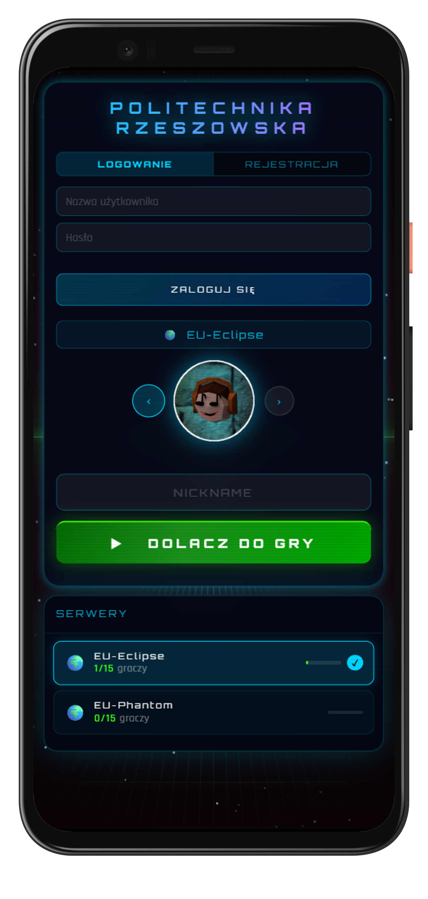

# 🎮 Cloud Game — Real-time Multiplayer Browser Game

> Wieloosobowa gra platformowa działająca w przeglądarce w czasie rzeczywistym. Serwer oblicza fizykę i rozsyła stan gry do wszystkich graczy **62,5 razy na sekundę** przez binarny protokół WebSocket — bez instalacji, bez wtyczek, działa na telefonie i desktopie.
> 
> Projekt stanowi przykład produkcyjnego podejścia do projektowania i wdrażania skalowalnych systemów chmurowych. Został wdrożony na **Azure Kubernetes Service**: serwery gry zarządzane są przez **Agones** (auto-skalowanie 1–20 instancji), serwer lobby z **HPA** (1–10 replik), komunikacja między serwerami przez **Redis pub/sub**, dane graczy w **CosmosDB**. Cała infrastruktura została zdefiniowana jako kod (**Terraform**), a wdrażanie jest w pełni zautomatyzowane dzięki pipeline'om CI/CD i architekturze **GitOps** (ArgoCD) — zero ręcznych operacji na klastrze.


---

<div align="center">

### 🟢 **[ZAGRAJ TERAZ W PRZEGLĄDARCE: http://20.215.181.95/](http://20.215.181.95/)**

</div>

---

## 📸 Zrzuty ekranu

Aplikacja jest w **pełni responsywna** — na desktopie grasz klawiaturą lub przeciągając myszą, a na telefonie sterujesz intuicyjnie, przesuwając palcem po ekranie.

<div align="center">

| Desktop | Mobile |
|:---:|:---:|
|  |  |

</div>

---

## 🎮 Sterowanie

| Akcja | Desktop | Mobile |
|---|---|---|
| **Ruch na boki** | Strzałki `←` / `→` lub `A` / `D`  lub przeciąganie myszą (z wciśniętym lewym przyciskiem myszy) | Przesuwanie palcem po ekranie (lewo / prawo) |

---

## 🚀 Kluczowe funkcje

- **Rozgrywka w czasie rzeczywistym** — binarny protokół WebSocket, 62,5 taktów/sekundę, minimalne opóźnienia
- **Cylindryczna mapa** — mapa zawija się horyzontalnie (wrap-around), proceduralnie generowane platformy z rosnącą trudnością
- **Do 15 graczy + 37 botów AI** na każdym serwerze gry — boty wypełniają świat i zapewniają ruch nawet bez innych graczy
- **Gra bez konta** — dołączanie jako gość z nickiem bez rejestracji; zalogowani gracze zapisują punkty i skiny
- **Sklep ze skinami** — zakup zmian wyglądu za punkty
- **Ranking na żywo** — aktualizowany co takt, widoczny dla wszystkich graczy w sesji
- **Auto-skalowanie serwerów** — Agones FleetAutoscaler dynamicznie tworzy i usuwa serwery gry pod obciążeniem (1–20 instancji)
- **Graceful shutdown** — gracz nie traci punktów; serwer zapisuje postęp i informuje lobby przed wyłączeniem
- **Bezpieczne uwierzytelnianie** — bcrypt (10 rund), ochrona przed enumeracją kont, jednorazowe tokeny wstępu

---

## 📚 Dokumentacja

Pełna dokumentacja techniczna znajduje się w katalogu [`docs/`](docs/).

| Plik | Opis |
|---|---|
| [`architecture-overview.md`](docs/architecture-overview.md) | Ogólna architektura systemu — diagram komponentów, porty, protokoły, przepływ dołączania gracza i pętla gry (62,5 tick/s) |
| [`mother-server.md`](docs/mother-server.md) | Serwer lobby — HTTP Express (auth, pliki statyczne), WebSocket uWS (lista gier, dołączanie), HPA 1–10 replik |
| [`child-server/`](docs/child-server/) | Serwer gry — fizyka po stronie serwera, kolizje, cykl życia WebSocket, konstruktor gracza, bot AI |
| [`matchmaking-flow.md`](docs/matchmaking-flow.md) | Przepływ dołączania — od kliknięcia „Dołącz" przez generowanie tokenu i Redis pub/sub do nawiązania połączenia z Child |
| [`binary-protocol.md`](docs/binary-protocol.md) | Wspólna biblioteka `shared/binary.js` — serializacja/deserializacja pakietów binarnych używana przez Mother, Child i przeglądarkę |
| [`protocol-frontend.md`](docs/protocol-frontend.md) | Protokół WebSocket po stronie klienta — wszystkie typy pakietów przychodzących i wychodzących między przeglądarką a serwerami |
| [`game-physics.md`](docs/game-physics.md) | Fizyka obliczana wyłącznie na serwerze — grawitacja, `jump_frame`, kolizje z kafelkami i graczami, respawn |
| [`map-generation.md`](docs/map-generation.md) | Proceduralny generator mapy `gen_lvl()` — cylindryczny tunel, checkpointy co `id=10n²`, rosnąca trudność, lazy generation |
| [`ranking-system.md`](docs/ranking-system.md) | Ranking na żywo — tablica `ranking[]` sortowana bubble-sortem po każdym przyroście punktów, kompresja do 1 bajtu |
| [`redis-pubsub.md`](docs/redis-pubsub.md) | Redis jako magistrala komunikacyjna — kanały `lobby_update` i `join:{id}`, HASH/SET danych serwerów, dead-man's switch TTL |
| [`mongodb-schema.md`](docs/mongodb-schema.md) | Schemat kolekcji `users` w CosmosDB — pola konta, punkty, tablica skinów, atomowe transakcje zakupu |
| [`agones-kubernetes.md`](docs/agones-kubernetes.md) | Agones Fleet i FleetAutoscaler — cykl życia GameServera (Ready→Allocated→Shutdown), ochrona aktywnych sesji przed uśmierceniem |
| [`security.md`](docs/security.md) | Warstwy bezpieczeństwa — bcrypt (10 rund), anti-enumeration, jednorazowe tokeny uint32, atomowe `$inc`+`$ne`, backpressure |
| [`scaling.md`](docs/scaling.md) | Skalowanie na trzech poziomach — HPA dla Mother (1–10 replik), FleetAutoscaler dla Child (1–20), węzły AKS |
| [`ci-cd-gitops.md`](docs/ci-cd-gitops.md) | Pipeline CI/CD — GitHub Actions buduje i pushuje obrazy do ACR, ArgoCD synchronizuje klaster z repo (GitOps, zero ręcznych deployów) |
| [`terraform.md`](docs/terraform.md) | Infrastruktura jako kod — tworzenie AKS, ACR, CosmosDB, NSG, K8s Secrets i instalacja Agones/ArgoCD przez Helm |
| [`local-development.md`](docs/local-development.md) | Trzy ścieżki uruchomienia — natywnie (Linux/WSL2), Docker (Redis+MongoDB w kontenerach), produkcja (GitHub Actions + AKS + ArgoCD) |
| [`load-testing.md`](docs/load-testing.md) | Testowanie obciążenia — scenariusze dla Mother (lobby) i Child (rozgrywka), co i dlaczego testujemy |

---

## 🏗️ Architektura

```
Przeglądarka gracza
  ├─ HTTP POST /auth/*          → Mother Express  (port 9876)
  ├─ WebSocket ws://LB:3001     → Mother uWS       (lobby)
  └─ WebSocket ws://IP:PORT/TOK → Child uWS        (gra, 62.5 tick/s)

Mother (K8s Deployment, HPA 1–10 replik)
  ├─ Express HTTP  :9876   → rejestracja, logowanie, pliki statyczne
  ├─ uWebSockets   :3001   → WebSocket lobby
  ├─ Redis pub/sub         → lista serwerów, tokeny dołączenia
  └─ CosmosDB (MongoDB)    → konta graczy

Child (Agones Fleet, 1–20 GameServerów)
  ├─ uWebSockets   :5000   → WebSocket gra
  ├─ Agones SDK            → cykl życia (Ready / Allocated / Shutdown)
  ├─ Redis pub/sub         → rejestracja serwera, odbiór tokenów
  └─ CosmosDB (MongoDB)    → zapis punktów po sesji

Redis  →  HASH game:{id}, SET game_ids, PUB/SUB
Azure  →  AKS + ACR + CosmosDB + NSG (TCP 7000–8000)
```

---

## 🛠️ Tech Stack

### Backend
| Technologia | Wersja | Rola |
|---|---|---|
| **Node.js** | 20+ | Środowisko uruchomieniowe |
| **uWebSockets.js** | v20.30.0 | Serwer WebSocket (5–10× szybszy od `ws`) |
| **Redis** | 7 | Pub/Sub (komunikacja Mother↔Child), stan lobby |
| **MongoDB / CosmosDB** | API 6.0 | Konta graczy, punkty, skiny |
| **Agones SDK** | ^1.56.0 | Zarządzanie cyklem życia serwerów gry w K8s |

### Infrastruktura
| Technologia | Rola |
|---|---|
| **Azure Kubernetes Service (AKS)** | Klaster Kubernetes (1 węzeł `standard_b2s_v2`) |
| **Azure Container Registry (ACR)** | Rejestr obrazów Docker |
| **Azure CosmosDB** | Zarządzana baza danych (MongoDB API) |
| **Agones** | Framework do serwerów gier na K8s (Google/Ubisoft) |
| **ArgoCD** | GitOps — automatyczny deploy z repozytorium |
| **Terraform** | Infrastruktura jako kod (IaC) |
| **GitHub Actions** | CI/CD — build obrazów Docker i deploy |
| **Kustomize** | Zarządzanie manifestami K8s (base + overlays) |

### Frontend
- Vanilla JavaScript 
- **Three.js** — renderowanie 3D gry (cylindryczna mapa, gracze, platformy)
- Responsywny layout HTML/CSS

---

## 💻 Szybki start / Wersja Live

Najszybszym sposobem na przetestowanie gry jest dołączenie do aktywnego serwera produkcyjnego:
👉 **[http://20.215.181.95/](http://20.215.181.95/)**

Jeśli jednak chcesz uruchomić projekt lokalnie w celach deweloperskich, postępuj zgodnie z poniższymi instrukcjami.

### Wymagania

- **Node.js 20+** (`node -v`)
- **Git**
- **Redis 7+** oraz **MongoDB 6+** — lokalnie lub przez Docker

### Opcja A — Natywnie (Linux / WSL2)

**1. Instalacja Redis i MongoDB**

```bash
# Redis
sudo apt install -y redis-server
sudo service redis-server start

# MongoDB 6.0
wget -qO - https://www.mongodb.org/static/pgp/server-6.0.asc | sudo apt-key add -
echo "deb [ arch=amd64,arm64 ] https://repo.mongodb.org/apt/ubuntu $(lsb_release -cs)/mongodb-org/6.0 multiverse" \
  | sudo tee /etc/apt/sources.list.d/mongodb-org-6.0.list
sudo apt update && sudo apt install -y mongodb-org
sudo service mongod start
```

**2. Klonowanie i instalacja zależności**

```bash
git clone https://github.com/rmietek/cloud-game.git
cd cloud-game

cd apps/mother-lobby     && npm install && cd ../..
cd apps/child-gameserver && npm install && cd ../..
```

**3. Uruchomienie**

```bash
# Terminal 1 — Mother (lobby)
cd apps/mother-lobby
node main.js
# → HTTP:      http://localhost:9876
# → WebSocket: ws://localhost:3001

# Terminal 2 — Child (serwer gry)
cd apps/child-gameserver
node main.js
# → WebSocket: ws://localhost:5000
```

> Zmienne środowiskowe nie są wymagane lokalnie — kod używa domyślnych fallbacków:
> `REDIS_URL=redis://localhost:6379`, `MONGO_URL=mongodb://localhost:27017`, `USE_AGONES=false`

**4. Otwórz przeglądarkę:** `http://localhost:9876`

---

### Opcja B — Docker (Redis + MongoDB w kontenerach)

```bash
# Uruchom bazy danych
docker run -d --name redis-local -p 6379:6379 redis:7-alpine redis-server --save ""
docker run -d --name mongo-local -p 27017:27017 -v mongo-data:/data/db mongo:6

# Uruchom Mother i Child (identycznie jak w Opcji A)
cd apps/mother-lobby     && node main.js
cd apps/child-gameserver && node main.js
```

**Wiele serwerów gry lokalnie:**

```bash
# Drugi Child na porcie 5001
cd apps/child-gameserver && node main.js 5001
```

---

## 🎯 Użycie

Po uruchomieniu otwórz `http://localhost:9876` w przeglądarce.

1. **Rejestracja / logowanie** — utwórz konto lub zaloguj się; możesz też grać jako gość
2. **Lobby** — wybierz serwer gry z listy (widoczna liczba graczy i dostępność)
3. **Dołączenie** — wybierz nick i skin, kliknij „Dołącz do gry" — połączenie z serwerem gry nawiązywane automatycznie
4. **Rozgrywka** — sterowanie klawiaturą/myszą (desktop) lub palcem po ekranie (mobile); opadaj przez platformy, unikaj czerwonych kafelków (kolców), wyprzedź przeciwników w rankingu
5. **Checkpointy** — przekraczanie kolejnych poziomów zapisuje punkt respawnu; po śmierci wracasz do ostatniego checkpointu
6. **Sklep** — za zdobyte punkty kupujesz nowe skiny widoczne dla wszystkich graczy

---

## 📁 Struktura projektu

```
cloud-game/
├── apps/
│   ├── mother-lobby/       # Serwer lobby (auth, lista gier, sklep)
│   ├── child-gameserver/   # Serwer gry (fizyka, kolizje, broadcast)
│   └── shared/
│       └── binary.js       # Współdzielony binarny protokół sieciowy
├── docker/                 # Dockerfile dla Mother i Child
├── docs/                   # Dokumentacja techniczna (18 plików .md)
├── gitops/                 # Manifesty Kubernetes + ArgoCD (Kustomize)
│   ├── base/               # Wspólna konfiguracja (Deployments, Services)
│   └── overlays/prod/      # Tagi obrazów Docker dla produkcji
├── infra/terraform/        # IaC: AKS, ACR, CosmosDB, Agones, ArgoCD
├── screenshots/            # Zrzuty ekranu (desktop, mobile)
└── .github/workflows/
    ├── ci.yml              # Build + push do ACR przy push na master
    └── terraform.yml       # Zarządzanie infrastrukturą (ręcznie)
```

---

 <p align="center">
  
  
  
  
  
  
  
  
  
  
  
  
  
</p>
